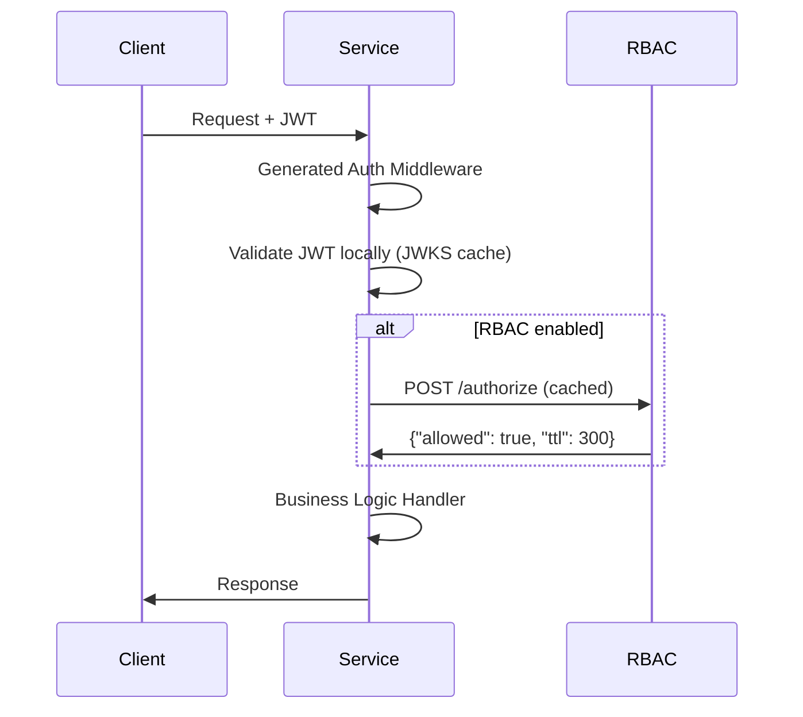

# Authentication & Authorization Architecture

**Status:** Draft | **Updated:** 2025-10-06 | **Version:** 0.1

## Overview

Defines authentication and authorization architecture for microservices with clear separation of responsibilities between identity management (AuthN) and access control (AuthZ).

## Current Implementation

Basic service-level authentication configuration is implemented in the YAML DSL:

```yaml
services:
  todo:
    auth:
      enabled: true
      mode: development
      required_scopes: ["read:todos", "write:todos"]
```

No full identity/authorization services are implemented yet.

## Planned Architecture

Two-service separation: Identity Service (AuthN) for user authentication and Authorization Service (AuthZ) for permission management, with JWT-based tokens and event-driven cache invalidation.

### Two-Service Design

#### Identity Service (AuthN)
**Responsibilities:**
- User authentication and lifecycle management
- Registration, login, passwords, MFA, password recovery
- OIDC issuer: Short-lived JWT emission (5-15 min)
- Refresh token generation and rotation
- User profile management

**Events Emitted:**
- `UserCreated`, `UserDisabled`, `UserUpdated`, `UserPasswordChanged`

**Endpoints:**
- `POST /auth/register`
- `POST /auth/login`
- `POST /auth/refresh`
- `POST /auth/logout`
- `GET /.well-known/jwks.json` (public keys with kid for rotation)
- `POST /auth/introspect` (optional, for immediate revocation)

#### Authorization Service (AuthZ)
**Responsibilities:**
- Role, permission, and assignment management (global and contextual)
- Policy Decision Point (PDP) API
- Local policy evaluation with in-memory cache
- Cache invalidation via events

**Core API:**
```json
POST /authorize
{
  "subject": "user_id",
  "action": "read",
  "resource": "property",
  "context": "org-123"
}
→ {"allowed": true, "ttl": 300}
```

**Administrative Endpoints:**
- `GET/POST /roles`
- `GET/POST /permissions`
- `POST /assignments`
- `GET /whoami/{user_id}` (debugging/UI assistance)

**Events Required:**
- `RoleAssigned`, `RoleRevoked`, `UserDisabled`
- `PermissionChanged`, `PolicyUpdated`

## RBAC Service Design (domain type)

### **Enhanced Permission Model**
Based on proven RBAC implementation with organizational hierarchy:

```yaml
# Core entities
user:
  id: uuid
  email: string
  name: string
  active: boolean

role:
  id: uuid
  code: string         # admin, team_lead, developer, viewer
  name: string
  description: string

permission:
  id: uuid
  action: string       # read, write, delete, admin
  resource: string     # todos, billing, users, teams

# Organizational hierarchy
organization:
  id: uuid
  name: string
  active: boolean

team:
  id: uuid
  org_id: uuid        # belongs to organization
  name: string
  active: boolean

# Relations
role_permissions:
  role_id: uuid
  permission_id: uuid

user_permissions:     # Direct permissions (avoids micro-roles)
  user_id: uuid
  permission_id: uuid
  context_type: string?    # 'org', 'team', null for global
  context_id: uuid?        # org_id or team_id

user_organizations:
  user_id: uuid
  org_id: uuid
  roles: string[]          # JSON array of role codes

user_teams:
  user_id: uuid
  team_id: uuid
  roles: string[]          # Contextual team roles
```

### **Authorization Strategies Comparison**

```yaml
# Phase 1: Enhanced RBAC (Recommended Start)
Approach: Hierarchical RBAC with direct permissions
Benefits:
  - Proven, well-understood model
  - Handles org → team hierarchy naturally
  - Direct permissions avoid role explosion
  - SQL queries remain reasonable
Drawbacks:
  - Limited dynamic policy support
  - Complex queries for cross-context permissions

# Phase 2+: Alternative Strategies
ABAC (Attribute-Based):
  - Dynamic rules based on user/resource attributes
  - "user.department == finance AND resource.confidential == false"

ReBAC (Relationship-Based):
  - "user X can read document Y if X owns Y OR X is member of team that owns Y"
  - Inspired by Google Zanzibar, implemented by OpenFGA

OPA/Rego Policy Engine:
  - External policy decision point
  - Complex rules in declarative language
  - "allow if user_is_admin; same_organization"

Casbin:
  - Go-native policy engine
  - Supports RBAC, ABAC, ReBAC in unified framework
  - Configuration-driven with code fallbacks
```

### **Evaluation Logic**
```go
func (r *RBACService) Authorize(ctx context.Context, req AuthzRequest) (*AuthzResponse, error) {
    userID := req.Subject
    action := req.Action
    resource := req.Resource
    contextType := req.ContextType  // "org", "team", null
    contextID := req.ContextID

    // Check direct permissions first (fastest path)
    if allowed := r.checkDirectPermissions(userID, action, resource, contextType, contextID); allowed {
        return &AuthzResponse{Allowed: true, TTL: 300}, nil
    }

    // Check role-based permissions with context hierarchy
    switch contextType {
    case "team":
        // Check team roles, then fallback to org roles, then global
        if allowed := r.checkTeamRoles(userID, action, resource, contextID); allowed {
            return &AuthzResponse{Allowed: true, TTL: 300}, nil
        }

        // Fallback to org-level permissions
        team, _ := r.getTeam(contextID)
        if allowed := r.checkOrgRoles(userID, action, resource, team.OrgID); allowed {
            return &AuthzResponse{Allowed: true, TTL: 300}, nil
        }

    case "org":
        // Check org roles, then global
        if allowed := r.checkOrgRoles(userID, action, resource, contextID); allowed {
            return &AuthzResponse{Allowed: true, TTL: 300}, nil
        }
    }

    // Check global permissions (no context)
    if allowed := r.checkGlobalRoles(userID, action, resource); allowed {
        return &AuthzResponse{Allowed: true, TTL: 300}, nil
    }

    return &AuthzResponse{Allowed: false, TTL: 60}, nil
}
```

## Token Strategy

### JWT Access Token (5-15 min)
```json
{
  "sub": "user_123",
  "scopes": ["read:todos", "write:billing"], // Coarse-grained scopes
  "exp": 1699123456,
  "kid": "key_rotation_id",
  "iss": "identity-service"
}
```

### Refresh Token
- Managed exclusively by Identity service
- Longer lived (days/weeks)
- Opaque, stored securely
- Single-use with rotation

## Service Communication & Middleware Strategy

### Event-Driven Architecture
- **Messaging**: NATS for reliable event delivery
- **Events**: Versioned, idempotent, replay-capable
- **Recovery**: AuthZ can rebuild cache from event stream

### **Recommended: Distributed Middleware Approach**

**Rationale**: Each service generates its own auth middleware via DSL configuration, avoiding centralized bottlenecks while maintaining consistency.

**DSL Configuration:**
```yaml
version: 0.1
name: "todo-app"
package: "github.com/company/todo-app"

# Simple service (JWT validation only)
services:
  notifications:
    kind: atom
    auth:
      enabled: true
      mode: production
      identity_service: "http://identity:8080"

# Complex service (JWT + RBAC)
services:
  billing:
    kind: domain
    auth:
      enabled: true
      mode: production
      identity_service: "http://identity:8080"
      rbac_service: "http://rbac:8080"
      required_scopes: ["read:billing"]
      cache_ttl: 300
```

**Generated Middleware Pattern:**
```go
func (s *Service) AuthMiddleware(next http.Handler) http.Handler {
    return http.HandlerFunc(func(w http.ResponseWriter, r *http.Request) {
        // Extract and validate JWT locally
        token := extractToken(r)
        claims, err := s.validateJWT(token)
        if err != nil {
            hm.Error(w, 401, "unauthorized", "Invalid token")
            return
        }

        // Optional RBAC check
        if s.rbacEnabled {
            allowed := s.checkRBAC(claims.Subject, r.URL.Path, r.Method)
            if !allowed {
                hm.Error(w, 403, "forbidden", "Insufficient permissions")
                return
            }
        }

        // Add user context
        ctx := context.WithValue(r.Context(), "user_id", claims.Subject)
        next.ServeHTTP(w, r.WithContext(ctx))
    })
}
```

### **Alternative: API Gateway Approach**

**When to Consider:**
- Heavy cross-cutting concerns (rate limiting, logging, routing)
- External client management complexity
- Centralized security policies

**Trade-offs:**
```yaml
Distributed Middleware:
* Pros
    * No single point of failure
    * Service-specific auth rules
    * Local JWT validation performance
    * Fits naturally with DSL generation
* Cons
    * Auth logic duplicated per service
    * Harder to enforce global policies

API Gateway:
* Pros
    * Centralized auth policy
    * Single point for rate limiting
    * Easier external client onboarding
* Cons
    * Single point of failure
    * Additional network hop
    * Vendor/tool dependency
```

### Middleware Flow (Recommended)


## Key Design Decisions

### JWT Scope Strategy
**Options:**
- **Coarse scopes**: `read:todos`, `admin:org-123` (recommended)
- **Fine-grained**: `read:todo:456`, `delete:user:789`
- **Hybrid**: Coarse in JWT + fine-grained via /authorize

**Trade-offs**: JWT size vs authorization calls, token refresh frequency vs security

### Context Hierarchy
**Challenge**: Users have role hierarchies across org → team → global contexts

**Key Questions:**
- Permission inheritance patterns
- Query efficiency across hierarchy levels
- Pre-computed vs real-time evaluation
- Conflict resolution between levels

### Web Service Integration
**Challenge**: UI needs user permissions for rendering
**Options**: Batch checks, permission caching, template-level authorization

### External API Authentication
**Options**: API keys, OAuth2 client credentials, JWT consistency

### Role Inheritance
**Decision**: Flat roles vs hierarchical vs hybrid approach

## Next Steps

### Immediate
1  **Enhance current auth config** - Extend YAML auth configuration
2. **Identity service prototype** - JWT/refresh token basic implementation
3. **Middleware generation** - Auto-generate auth middleware from YAML config

### Medium Term
4. **Authorization service** - Basic RBAC with /authorize endpoint
5. **Event integration** - NATS-based cache invalidation
6. **Web service auth** - UI permission checking patterns

### Long Term
7. **Advanced features** - Context hierarchy, role inheritance
8. **External clients** - API keys and OAuth2 support
9. **Policy engine** - Advanced authorization patterns

## Service Type Integration

- **atom**: Simple JWT validation + scope checking
- **domain**: Complex RBAC with context and batch operations
- **composite**: Cross-service permission aggregation
- **web**: Template-level authorization and UI permission caching

---

**Summary**: Two-service architecture (Identity + Authorization) with JWT-based authentication, RBAC authorization, and event-driven cache management. Current implementation includes basic service-level auth configuration in YAML.
