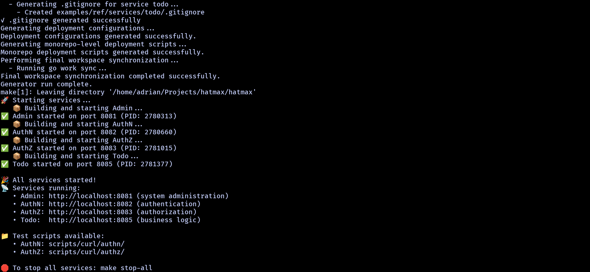
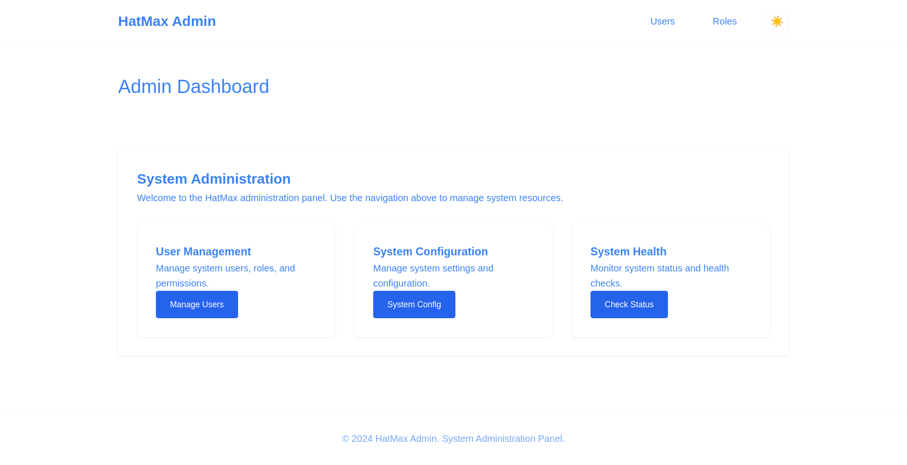
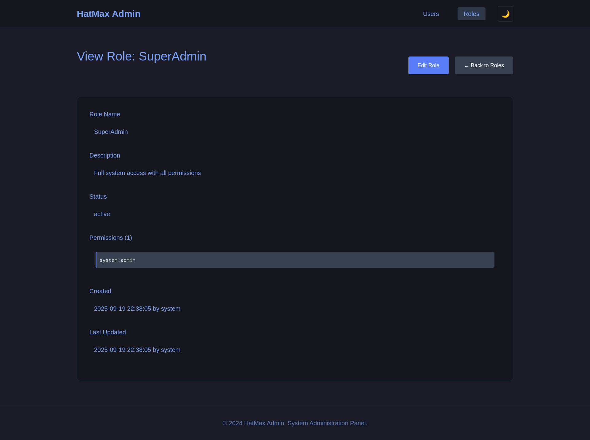

# Gallery

Some generated code in action.

## Monorepo Generation

The initial project structure after running the generator.

## Admin Dashboard

Simple dashboard with theme toggle.

## User Management

User listing with basic actions.

## User Permissions

Assigning permissions to users.

## Role Management

Role listing.

## Role Editing

Editing role permissions.

## Dark Mode

The same interface in dark mode.

