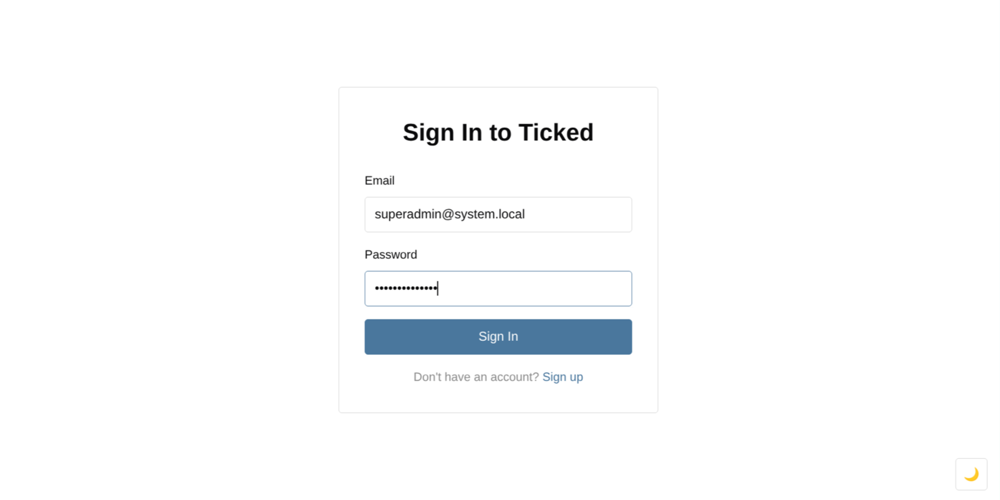
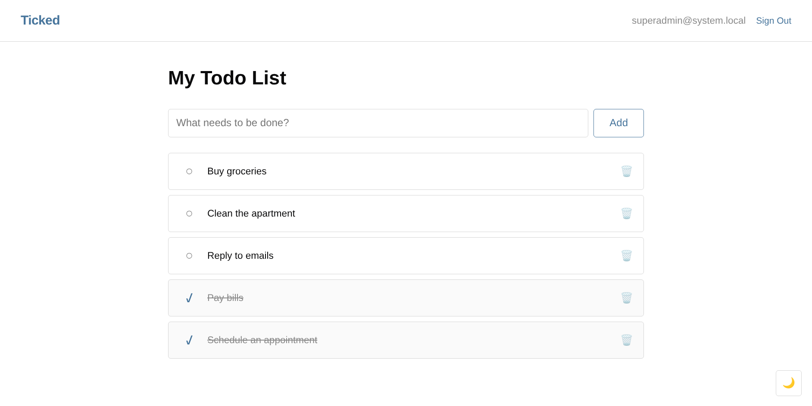
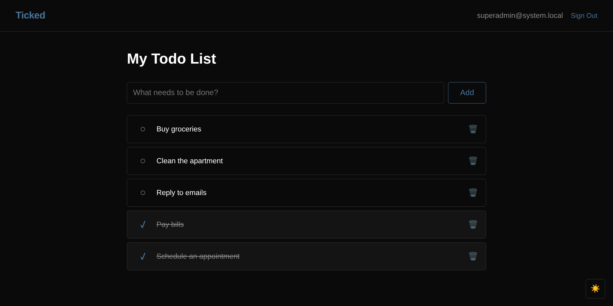
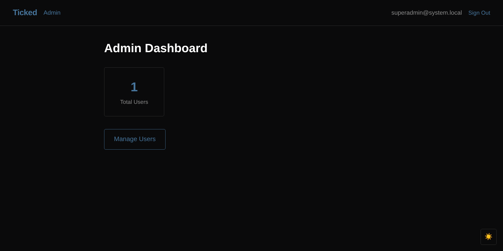

# Gallery

These images show the Ticked reference application built with Hatmax.

## Authentication

## Todo list

## Administration

To run this application, follow the
[Ticked README](../../../examples/ticked/README.md).
